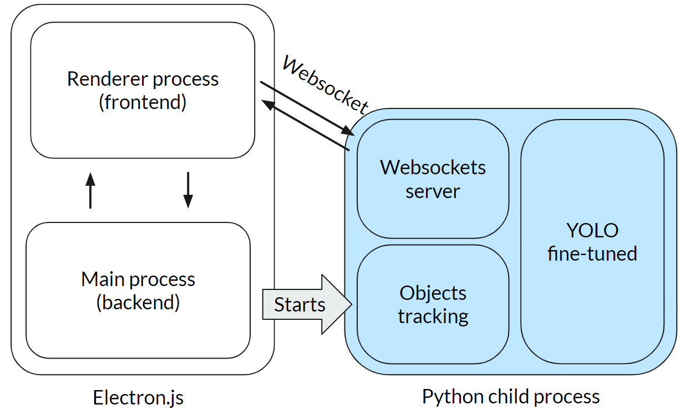
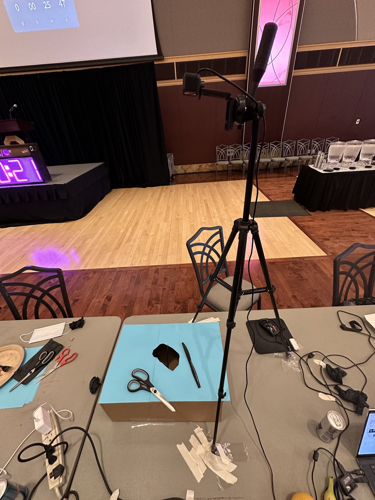

# Uncountable - Making Surgeries Safer with Computer Vision

>[!TIP]
> 🏆 **1st place at [Hack OHI/O 2023](https://hack.osu.edu/2023)**

Uncountable leverages cutting-edge Computer Vision technology to detect items forgotten in patients during surgery, ensuring a safer surgical environment. It was created in 24 hours during the 2023 HackOHI/O Hackathon, winning 1st place out of 200 teams. Using computer vision, Uncountable tracks surgical instruments during a procedure, alerting the surgeon if any instruments are left inside the patient.


> 🎥 **[Watch the Live Demo](https://www.youtube.com/watch?v=QB0wInJyydk)**


## Technologies Used
- 🐍 **Python**
- 🦾 **YOLOv8**
- 🔥 **Pytorch**
- 🌐 **Websockets**
- 🟢 **Node.js**
- ⚛️ **Electron.js**

## Architecture



The architecture of Uncountable is designed to ensure high-performance real-time tracking and alerting during surgical procedures. It consists of the following components:

1. **Main Electron.js process (backend)**:
  - Spawns and manages Python child processes for object detection and tracking.
  - Manages runtime configuration and communication with the frontend application.

2. **Computer Vision Module**:
  - Utilizes fine-tuned **YOLOv8** model for object detection to identify and track surgical instruments.
  - **Pytorch** is used for model training and inference.
  - **Websockets** are used for real-time data transmission.

3. **Renderer Electron.js process (frontend)**:
  - Displays the real-time video feed from the camera with overlaid instrument tracking.
  - Provides a user interface for configuring the system and viewing alerts.
  - Communicates directly with the Pyhon child processes for object detection and tracking.
  - Built with pute **HTML**, **CSS**, and **JavaScript** for performance and responsiveness.

## Physical setup

To create a computer vision software, we first needed some hardware: A “budget-conscious” cardboard box to simulate a patient’s body and a top-down web camera to capture the movement of the instruments. We found both in a matter of 30 minutes (running all around campus) and started the works.



We decided to base our model off YOLOv8, a state-of-the-art real-time object detection model, and enhanced its performance by collecting a custom dataset of instrument images. We took pictures of every related tool we could find at the hackathon: plastic knives, scissors, tissues, and hands in the view of the camera to fine-tune object detection and background subtraction.

Collected images can be found in the `images` folder of this repo.

## Full story

Read the full story of creating Uncountable on Alex's website: [https://gulko.net/projects/uncountable](https://gulko.net/projects/uncountable)

## Getting Started

1. Clone the repository:
    ```sh
    git clone https://github.com/DavidNovikov/hackohio2023.git
    cd hackohio2023
    ```

### Electron.js Application


#### Prerequisites
- [Node.js](https://nodejs.org/) with npm

#### Running the Application

1. CD into the `client` directory:
    ```sh
    cd client
    ```

1. Install dependencies:
    ```sh
    npm install
    ```

1. Compile the UI:
    ```sh
    npm run make
    ```

1. Run the executable from:
    ```sh
    ./out/surgeio-win32-x64/surgeio.exe
    ```

### Python Object Detection

#### Prerequisites
- [Python 3.8+](https://www.python.org/)

#### Preparing the Environment

1. CD into the `python` directory:
    ```sh
    cd server
    ```
1. Install dependencies:
    ```sh
    pip install -r requirements.txt
    ```

## License
This project is licensed under the AGPL-3.0 License - see the [LICENSE](LICENSE) file for details.

## Acknowledgements
Special thanks to the Hack OHI/O 2023 organizers and volunteers for their support and amazing opportunity.
